# Admin UI audit — colour, UI and UX refresh

Date: 2026-10-05 · Target: admin web (`/admin`) on branch `claude/ui-ux-responsive-redesign-1de4d4` (commit `6d22b77`)
Users: the gym owner and the front-desk admin. They are not technical. They use a phone or a desk laptop.
Language: ASD-STE100 (Simplified Technical English).

## 1. Result

The app works well. The base is accessible and fast. The app looks bland for four reasons:

1. The brand colour is weak. The orange is dark (#DC7400) and appears in approximately 6 places only.
2. The surfaces are flat. Cards and page have almost the same colour (1.05:1). Cards have no shadow.
3. Some inputs look disabled. The search box and the date fields have a grey fill.
4. The screens show only problems (overdue, ended). No screen shows numbers, faces or progress.

Do not change the brand. Use the same Fionis orange and navy (owner decision D-029), but use them with more strength.
The name of this direction is **"Navy & Flame"**: navy is the stage, orange is the flame, all other colours step back.

Estimated effort: 2–3 days for the visual refresh. Steps 1–3 in section 10 give most of the visible result.

## 2. Method

Five agents did the audit at the same time. Each agent used Playwright on an isolated copy of the app (own database, seeded demo data).

| Area | What the agent did |
|---|---|
| Visual and colour | Measured colours and contrast. Made a new token set. Injected it into the real app for before/after screenshots. |
| UX flows | Did 7 daily jobs on desktop (1440×900) and phone (390×844). Counted clicks. Recorded friction. |
| Accessibility | Ran axe on 18 routes, light and dark. Measured contrast, touch targets, keyboard and layout at 320–1440 px. |
| Design system code | Read `globals.css`, `components/ui`, `components/common` and the screens. Counted tokens and styles. |
| Benchmark | Studied PushPress, Wodify, Glofox, TeamUp, Gymdesk and SugarWOD. |

## 3. Before and after

The "after" screenshots are mock-ups: proposed tokens and CSS injected into the real app. The avatars and the number band are injected HTML.
Note: some counts are different between "before" and "after", because the UX agent changed demo data during its tests.

| Screen | Before | After |
|---|---|---|
| Home (desktop) | 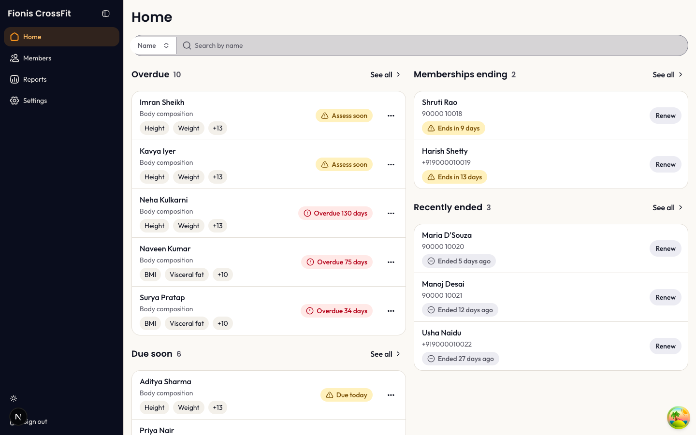 | 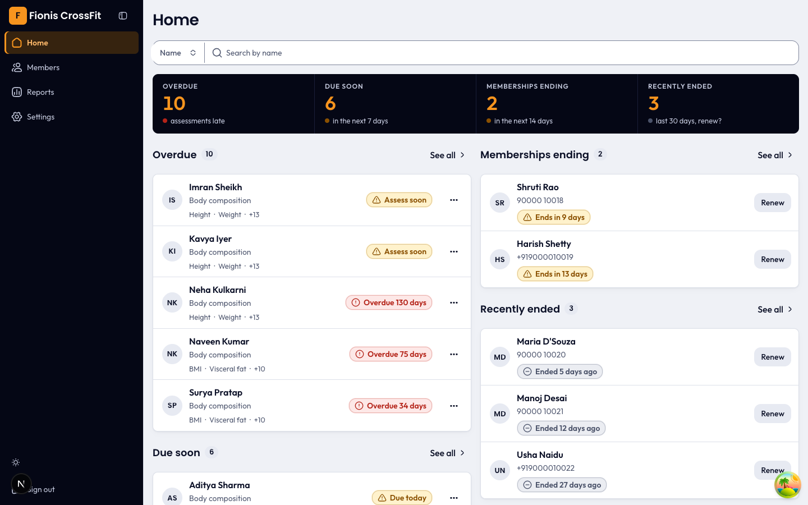 |
| Home (phone) | 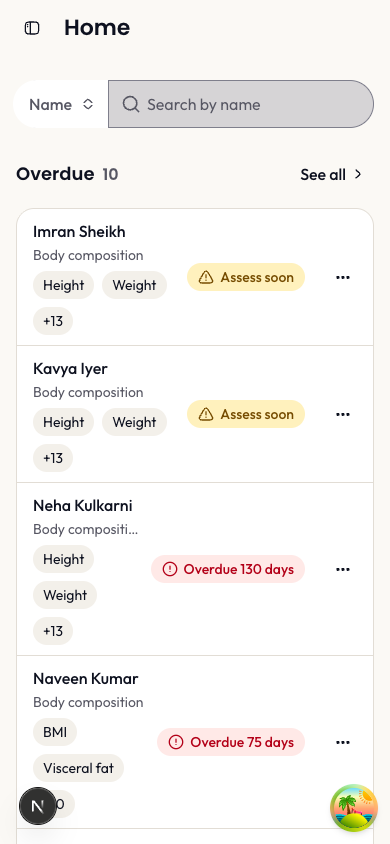 | 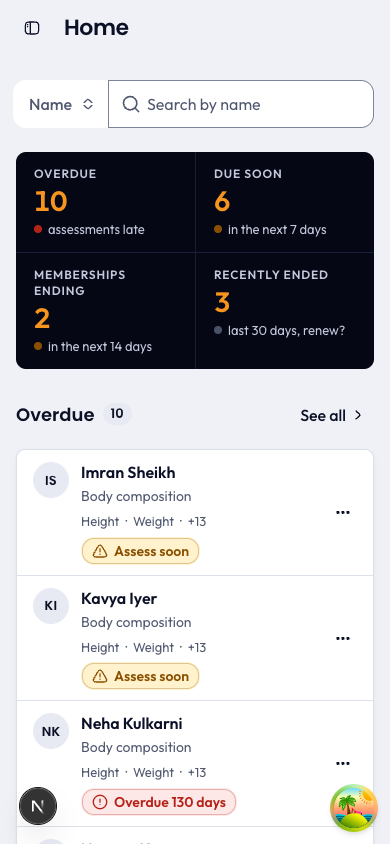 |
| Members | 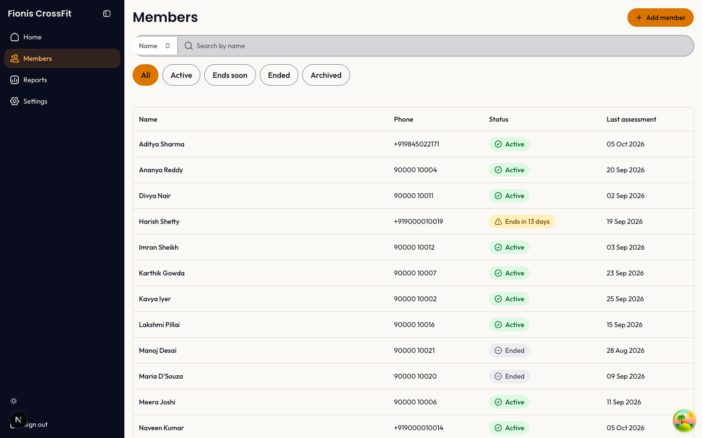 | 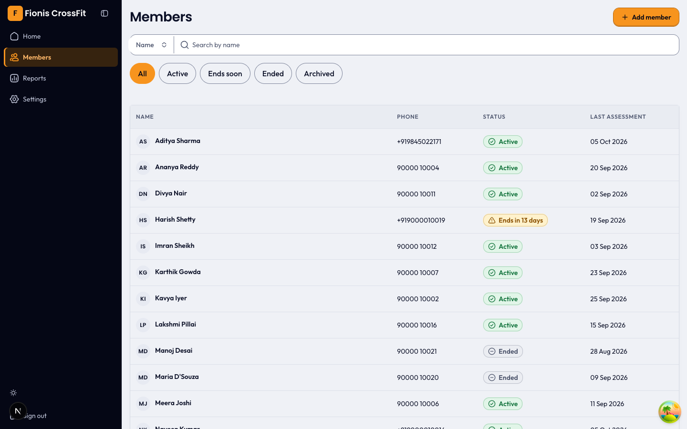 |
| Members (dark) | 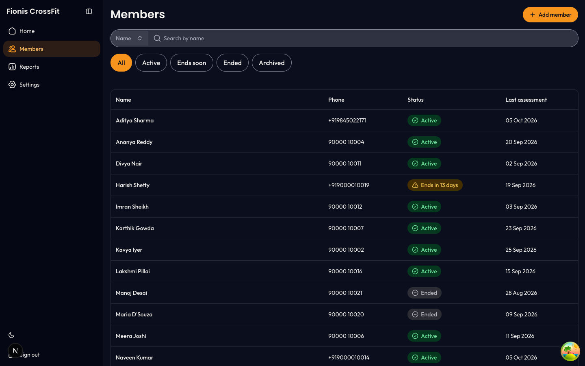 | 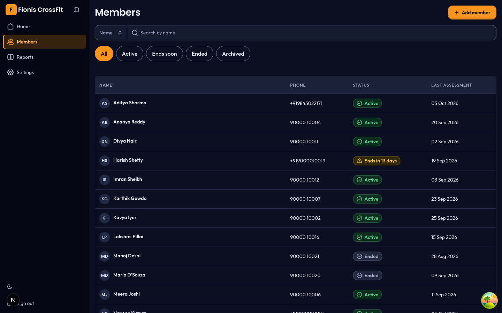 |
| Member detail | 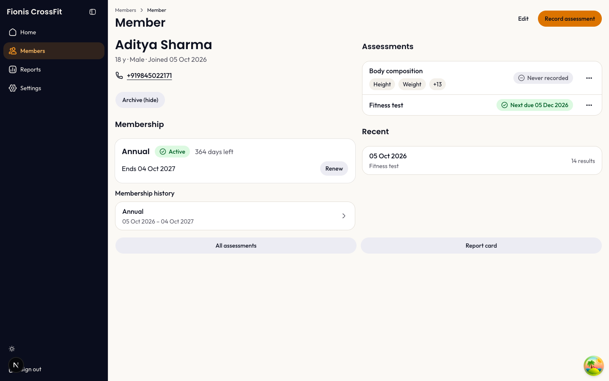 | 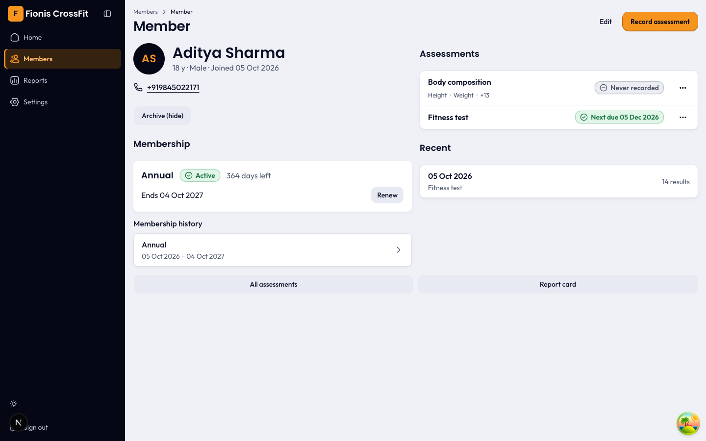 |
| Edit member | 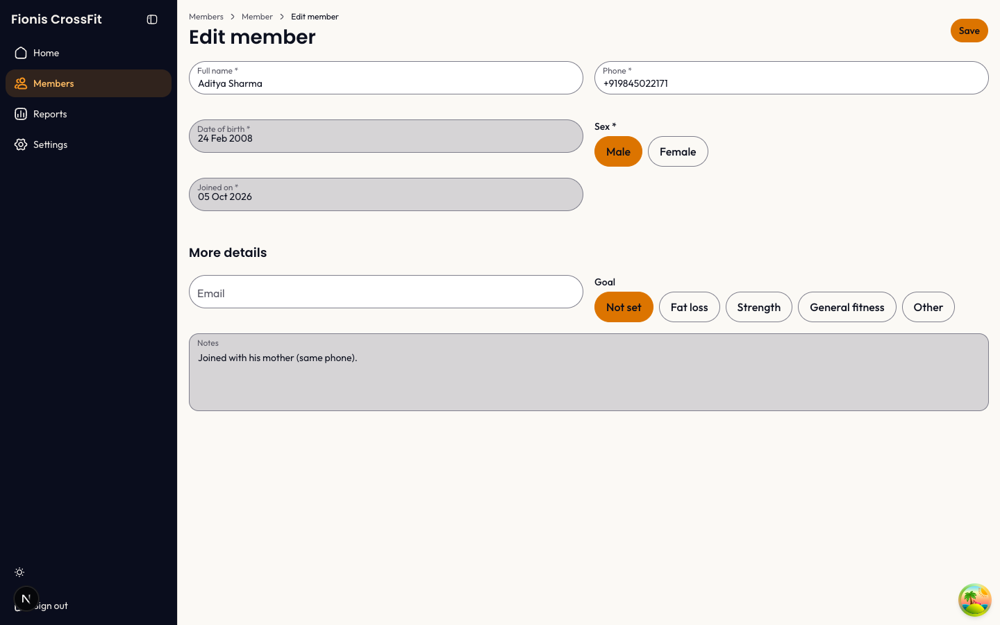 | 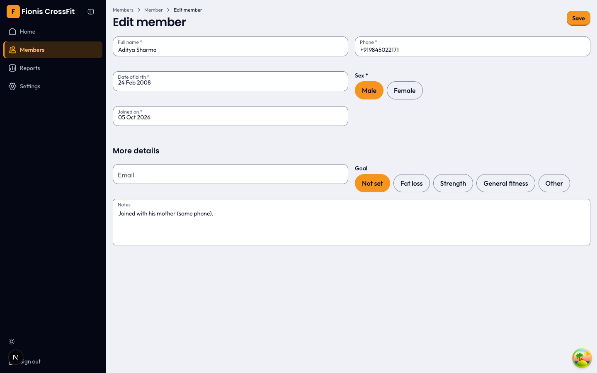 |

## 4. Why the app looks bland (measured)

| # | Problem | Measurement |
|---|---|---|
| D1 | The orange is muddy. Light `--primary` is #DC7400, not Fionis #F7941E. On the cream page it looks brown. | 3.05:1 on page |
| D2 | Cards do not separate from the page. No shadow on any screen. | page vs card 1.05:1 |
| D3 | Inputs look disabled. `bg-input/30` gives grey #D6D4D5 on search, date fields, month pickers, time zone. | fill vs page 1.40:1 |
| D4 | All shapes are pills (26 px radius). This looks like a generic template. | — |
| D5 | Warm cream and warm greys do not match the cool navy sidebar. | hue 80 vs 273 |
| D6 | Weak type hierarchy. Names (500) are not stronger than phone numbers. Table headers look like data rows. | — |
| D7 | Row noise. The grey "Height / Weight / +13" chips are louder than the names. On phones they wrap to 3 lines. | ~110 px per row |
| D8 | No numbers on Home. No faces (avatars) anywhere. The brand colour appears approximately 6 times. Chart colours are not used. | — |
| D9 | Dark mode: sidebar (L 0.135), page (0.17) and card (0.21) blend together. | — |

## 5. Colour changes

Replace the tokens in `frontend/src/app/globals.css` with the set in [tokens.css](tokens.css) (light and dark).
All text pairs pass WCAG AA 4.5:1. All control edges pass 3:1. The visual agent calculated each pair.

### 5.1 Light theme — main values

| Token | Now | New | Use |
|---|---|---|---|
| `--background` | #FBF9F5 (warm cream) | **#EFF1F6** (cool, navy tint) | page |
| `--card` | #FFFFFF | #FFFFFF + soft shadow | cards, lists, tables |
| `--primary` | #DC7400 | **#F7941E** (true Fionis orange) | main buttons, active items |
| `--primary-foreground` | navy | #050715 (8.79:1 on orange) | text on orange |
| `--primary-edge` (new) | — | **#B86200** | button edge, keeps 3:1 |
| `--brand` | orange text | **#A64F00** (5.6:1) | orange text, KPI numbers |
| `--border` | #E2DDD5 | #DCE0E9 | lines |
| `--ring` | 50 % orange | #B86200, solid 2 px | focus |
| `--sidebar` | navy | #050715 | sidebar |
| `--sidebar-accent` | brown pill | #36230F + 3 px orange bar | active menu item |
| `--chart-1…5` | not used | orange, navy-blue, teal, magenta, slate | sparklines, bars |
| `--radius` | 0.625rem (pills) | **0.3125rem** | controls 13 px, cards 9 px |

### 5.2 Status colours

Keep the owner's tone map (BR-REC-185). Use the colours the same way on all screens.

| Tone | Text | Fill | Meaning |
|---|---|---|---|
| success | #12733C | #E1F5E8 | active, on track |
| warning | #8A5000 | #FFF2CC | due soon, ends soon |
| danger | #B42318 | #FDE8E7 | overdue |
| info | #1F4FC2 | #E4ECFF | information |
| neutral | #4A5269 | #EBEDF2 | ended, archived |

Rules:
- Use one red only. Set `--destructive: var(--danger)`. Now the app has two reds (`destructive` ×10, `danger` ×8).
- In dense tables, use a dot and a word. Use the full pill on cards only.
- Add a 1 px tone edge to status pills and set the weight to 600.

### 5.3 Dark theme

Make the surface steps larger: sidebar ≈ L 0.12, page ≈ 0.17, card ≈ 0.225, border white 12 %. Do not use shadows in dark mode. Use a lighter card and a stronger border.

## 6. Typography

Keep Outfit (text) and Poppins 600 (titles). Change the use:

| Role | Now | New |
|---|---|---|
| Page title | Poppins 600 28 px | same, tight tracking; 22 px on phones |
| Section count | grey number ("Overdue10") | small pill, 13 px 600, with a space for screen readers |
| Member name in rows | Outfit 500 | **Outfit 600** |
| Table header, KPI label | 14 px regular | **12 px 600 uppercase**, muted, +0.06em |
| KPI numbers | Geist Mono | **Outfit 600 32–34 px `tabular-nums`**, `--brand` colour |
| Number columns | Geist Mono | Outfit `tabular-nums` (Outfit has true tabular figures; Poppins does not) |
| Hints and floating labels | 12 px | 13–14 px |

The change from Geist Mono to Outfit conflicts with BR-REC-123 and BR-REC-214. The owner must decide (section 9).

## 7. UI changes per screen

### 7.1 Shell (all screens)
- Show the orange "F" mark next to "Fionis CrossFit" also when the sidebar is open.
- Active menu item: dark orange tint, 3 px orange bar, orange icon and text 600.
- Put the theme switch, the user initials and "Sign out" in one row at the bottom of the sidebar.
- Phone menu: use the ☰ icon and the name "Open menu" (BR-REC-178, 137). Now it is a panel icon called "Toggle Sidebar".

### 7.2 Home
- Add a navy **number band** under the search: Overdue · Due soon · Memberships ending · Recently ended. Each tile shows a label, a big orange number, a tone dot and one line. Each tile opens its "See all" list. The counts are already loaded (`meta.total`). No new API is necessary.
- Add initials avatars to each row.
- Replace the grey chips with quiet text: "Height · Weight · +13". When all measurements are due, show "All 15 measurements".
- On phones: put the status under the name. Keep the chips on one line.

### 7.3 Members, Due list, Memberships
- Add a `bg-muted` header band with 12 px uppercase labels. Make the name column 600.
- Add a 32–36 px initials avatar before each name.
- Show counts on the filter tabs: "Ends soon (4)".
- Due list: add the Phone column (BR-REC-183) and a "what is due" summary.
- Put the empty actions header in an `sr-only` label "Actions".

### 7.4 Member detail
- Use the member name as the page title. Remove the generic "Member" title. This also fixes the cut title "Membe" on phones.
- Add a 64 px navy avatar with orange initials. Add a meta line: status, plan, age, phone, joined date.
- Add one banner for the most urgent next step, for example "Body composition overdue 34 days · Record now".
- Move "Archive (hide)" into the ⋯ menu. Move "Report card" to the header. Change the grey full-width bars to outline buttons with icons.

### 7.5 Record assessment
- Collapse "Paper column" and "Save & next date" under one link: "Copying from the paper card?".
- After a partial save, show progress: toast "Saved 3 for Naveen · 12 still due" and row text "3 of 15 done".
- Block impossible values (for example body fat > 100 %) with a field error. Keep "Please check" for unusual values only.
- Reserve space for the top alert, so the form does not move.

### 7.6 Reports
- Start with one plain sentence: "17 of 20 members improved body fat since their first reading".
- Change "n = 20 · 1 with one reading not counted" to "Based on 20 members (1 more has only one reading)" (BR-REC-113 copy change).
- Show "Body fat down 2.0 % on average · better". Write the KPI number in `--brand` (BR-REC-186 requires it; now it is not).
- Leaderboard: name the measurement. Add medals for rank 1–3.
- Add "Download CSV" to the Reports header. The owner looks for export here, not in Settings.
- Make the month pickers 48 px tall on phones (now 36 px).

### 7.7 Report card
- Desktop: use the phone card grid ("↓ 4.3 kg better" + sparkline). This is the best screen in the app. Keep the table for print only.
- For a first reading, show "First reading" instead of "– – – –".

### 7.8 Forms (Add member, Edit member, Settings)
- Use one input style: white with an outline. Use grey only for disabled fields.
- Let the user type the date of birth (dd/mm/yyyy). Keep the calendar as an option. Now it takes 4 clicks.
- "Starts on" follows "Joined on". Preselect a plan.
- Plain words: "Enter the gym name" (not "Use 2 to 60 characters"), "Warn if lower / higher than" (not "Please check below / above"), "Show in a group on the report card" (not "Report table").
- Time zone: show "India (Kolkata) · IST", not "Asia/Kolkata".

### 7.9 Login
- Desktop: navy left panel with the logo and one line. Form on white at the right.
- Fix the broken logo first (section 8, item 1).

### 7.10 Empty states
- Keep the orange wash. Add one icon in a 40 px circle above the sentence.
- Use warm words: "Nobody is overdue. Nice work."

## 8. Bugs found (send each to `/bug`)

| # | Bug | Cause | File |
|---|---|---|---|
| 1 | Login logo does not show. | The matcher does not exclude `.avif`, so `/Fionis-Logo.avif` goes to `/login`. | `frontend/src/proxy.ts:121` — add `avif`, `woff2` |
| 2 | Phone search by number fails in "Name" mode ("No member matches 10016"). | Search uses Name mode by default. | `MemberSearch.tsx`; spec change C2 |
| 3 | Phone numbers show in two formats ("90000 10016" and "+919000010019"). | `formatPhone` formats exactly 10 digits only (BR-REC-127). | `frontend/src/lib/format.ts` |
| 4 | "Never recorded" is grey on member detail but amber in the Choose-assessment dialog. | Two different tone maps (BR-REC-185). | `ChooseAssessmentSheet.tsx`, `MemberBlocks.tsx`, `lib/statusTone.ts` |
| 5 | Search, date, month and time zone fields are grey. | The fill fix in `globals.css:276-283` misses `input-group` and `popover-trigger`. `DatePicker.tsx:26` uses `bg-input/30`. | `globals.css`, `DatePicker.tsx`, `MonthPicker.tsx:77`, `TimeZoneCombobox.tsx:52` |
| 6 | Unknown member id shows 3 error blocks and live buttons. | No single not-found state. | `components/views/member/MemberView.tsx` |
| 7 | Browser console shows a 400 error and "Encountered a script tag" on each page. | Probably the theme/sidebar script. | investigate |

## 9. Accessibility

The base is strong. axe found 0 serious or critical issues on 18 routes, light and dark. All text passes 4.5:1. No page scrolls sideways at 320–1440 px. Dialogs trap focus and close on Esc.

Fix these items:

| Pri | Issue | WCAG | Fix |
|---|---|---|---|
| P1 | Names and titles are cut on phones ("Membe", "Bod…", "Imran S…"). | 1.4.10 | `ListRow.tsx:38-39`: use `line-clamp-2` not `truncate`. Status under name below 400 px. |
| P1 | All pages have the same `<title>`. Screen readers do not announce a page change. | 2.4.2 | Keep your brand title as the default. Add a template `'%s · Fionis India'` and one title per page. |
| P2 | Focus ring is faint (1.93:1 light). | 1.4.11 | Add `:focus-visible { outline: 2px solid var(--ring); outline-offset: 2px }`. |
| P2 | Focus can go under the fixed Save bar on phones. | 2.4.11 | Add `scroll-padding-bottom` in `globals.css`. |
| P2 | The key "d" switches the theme. The user cannot stop this. | 2.1.4 | Remove it, or require a modifier key (`ThemeProvider.tsx:39-71`). |
| P3 | No skip link. Save comes before the fields in tab order. A failed Save fires 6 `role="alert"`. | 2.4.1, 2.4.3 | Add "Skip to content". Put the action bar after the form in the DOM. Keep `role="alert"` on the summary only. |

## 10. Plan

| Step | Work | Effort | Spec change? |
|---|---|---|---|
| 0 | Change request: ux spec v10 (number band, avatars, name as title, fonts, chip wording, status position on phones). Add an entry to `docs/decisions.md`. | S | yes — `/freeze` |
| 1 | Token pass in `globals.css`: new colours, radius, shadow tokens, `--brand-soft`, one red, input fill fix, focus outline. | S | no |
| 2 | `bunx shadcn add avatar alert empty item`. Check the `globals.css` diff after the CLI. | S | no |
| 3 | Shared parts in `components/common/`: `StatCard`, `MemberAvatar`, `Notice` (replaces 6 hand-made alerts), `EmptyState` icon, one surface style, `PageHeader` leading/meta slots. | M | partly |
| 4 | Shell: sidebar mark, active item, footer row, ☰ menu. | S | small |
| 5 | Screens: Home band, tables, member detail, Reports, report card, forms, login. | L | yes (step 0) |
| 6 | Verify: typecheck, lint, `bun test`, `check:colors`, build. New screenshots. axe in light and dark. `test-writer` adds tests for v10 rules. | S | — |

Limits from the repo:
- `ux.md` v9 is frozen. Rules in `tests/ux/*` fix tokens, fonts, sidebar lightness and the "F" mark. No test checks card, badge, button or shadow classes, so a screen restyle has low risk.
- Change `components/ui` only with the shadcn CLI. Put new parts in `components/common/`.
- Do not use chart libraries (BR-REC-215). Make charts as SVG.

## 11. Decisions for the owner

| # | Question | Recommendation |
|---|---|---|
| 1 | Use true #F7941E with a dark edge for buttons? | Yes. D-029 names #F7941E. |
| 2 | Replace Geist Mono with Outfit `tabular-nums` for numbers? (BR-REC-123, 214) | Yes. Mono looks like code. One font download less. |
| 3 | Add the Home number band and initials avatars now (spec v10) or later (GitHub issue)? | Now. They give the largest visible result. |
| 4 | Record assessment: 15 fields in 2 columns are 1,080 px tall, so BR-REC-188 ("one screen at 1440×900") fails. | Use 3 columns from 1280 px. |
| 5 | Search: find members by name or phone automatically (digits → phone)? (BR-REC-201, D-031) | Yes. |

## 12. New ideas (not in the frozen spec — create GitHub issues, `mod:member-records`)

These ideas make the app motivating for the owner. Do not add them to the current build.

1. "Wins this week" card on Home: birthdays, join anniversaries, members who improved ("Rohan: body fat 20.1 → 18.6 %").
2. Save toast with progress: "Saved 15 for Surya · weight down 1.3 kg since August".
3. "Clear the list" progress bar for overdue assessments.
4. Renewal outlook on Reports: renewals due in 30 days, last month's renewal rate.
5. Share the report card as an image or PDF for WhatsApp.
6. Undo in toasts (renew, Assess soon, Remind me later). This needs an API path.
7. Sparkline for each measurement on member detail.
8. Personal-best badge on the report card.

Out of scope: member tags (injury, goal), attendance-based "at risk", photo upload.

## 13. Benchmark — patterns to copy

| Pattern | Who uses it | Our screen |
|---|---|---|
| "Needs attention" rows: icon + count + faces | PushPress | Home number band |
| Avatar on each person row | all six products | all lists |
| Profile header: photo, name, chips, meta row, one main action | PushPress, Glofox | member detail |
| One inline alert for the next step | PushPress | member detail |
| Strict green / amber / red / grey | PushPress, Wodify | all |
| Plain-sentence headline on reports | TeamUp | Reports |
| KPI tile with change vs last period | Glofox, PushPress | Reports |

Note: Wodify uses colours close to ours. In January 2026 it made its light-mode orange darker for contrast. Our `--brand` #A64F00 for orange text follows the same rule.

## 14. Evidence

- Token file: [tokens.css](tokens.css)
- Full agent findings, scripts and all screenshots (temporary): session scratchpad `audit/` — `findings-{visual,ux,a11y,system,benchmark}.md`, `shots/`, `visual/shots/`, `ux/shots/`, `a11y/`.
